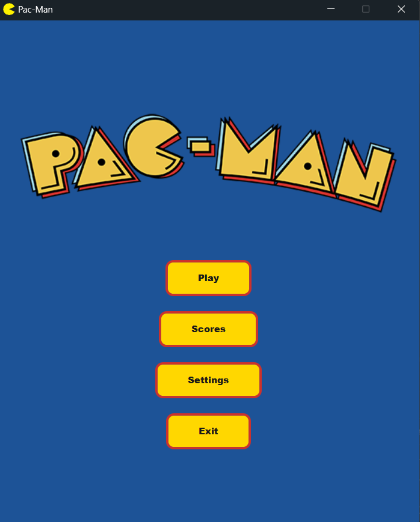
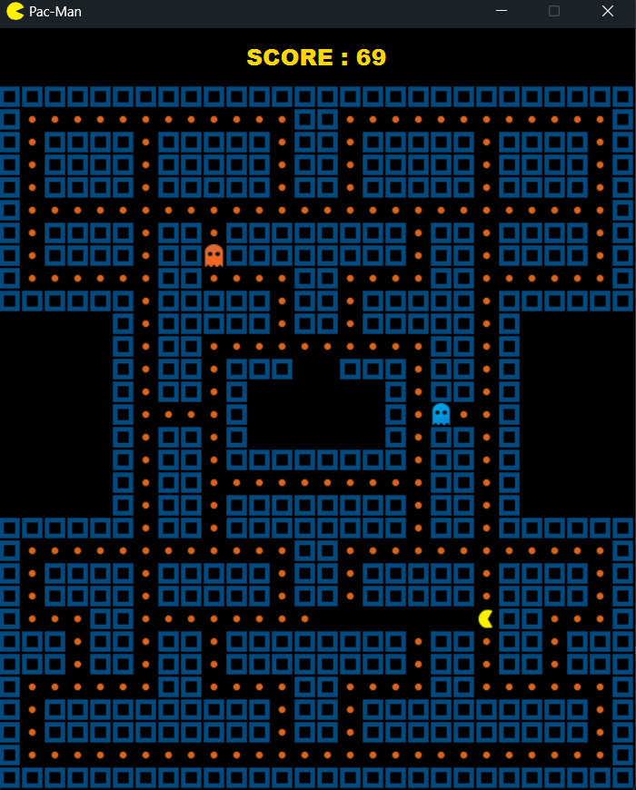
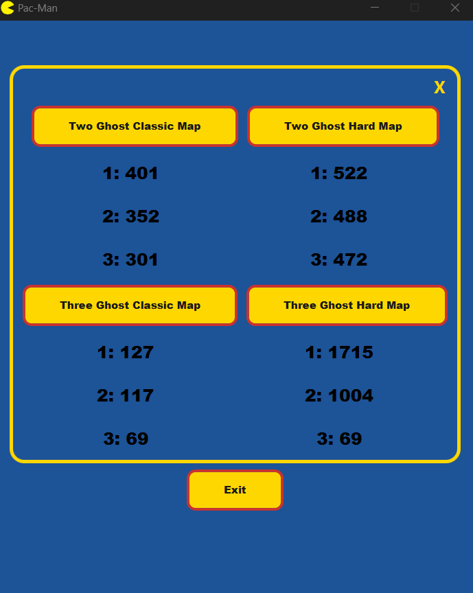
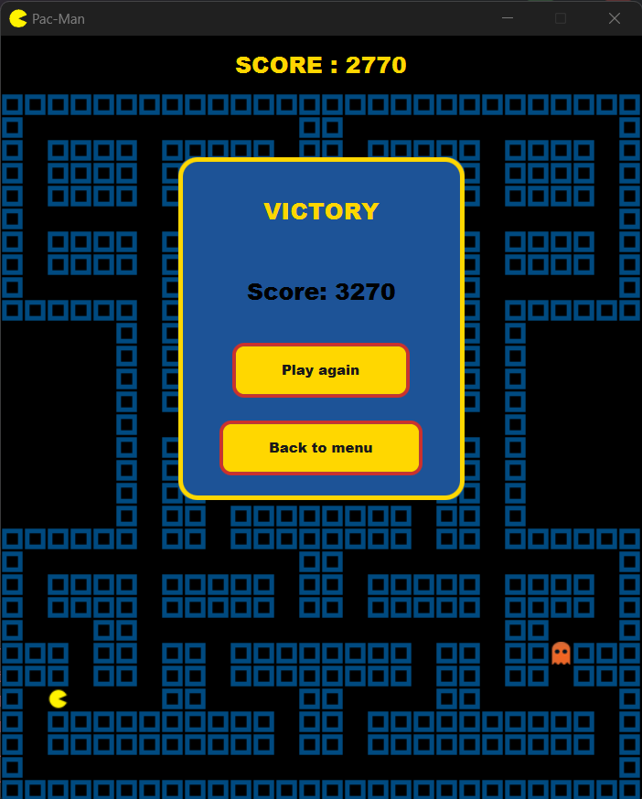
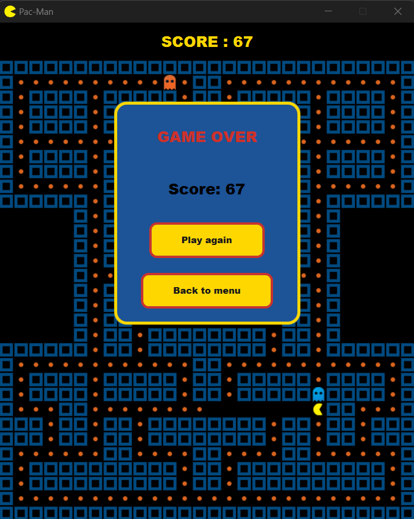

# 🎮 Pacman Game

A Pacman game developed using **Java** and **JavaFX** as the final project for the **Advanced Programming** course at the **University of Zanjan**.

---

## ✨ Features

- Graphical user interface with:
    - Main menu
    - Top scores page
    - Settings menu
    - Game Over message
    - Victory message
- Background music and sound effects
- Score recording and persistent score storage
- Two game modes based on the number of Ghosts:
    - 2 Ghosts
    - 3 Ghosts
- Three different Ghost AI behaviors:
    - `RandomAI`
    - `ChaserAI`
    - `BFSAI`
- Two different maps:
    - Classic Map, based on the original Pac-Man layout
    - Hard Map
- SQLite database for storing scores

---

## 👻 Ghost AI

Each Ghost uses a different AI behavior, resulting in different levels of difficulty.

### 🔵 Blue Ghost — RandomAI

The Blue Ghost uses the simplest AI, called `RandomAI`.

It moves semi-randomly through different areas of the map and does not actively target or chase Pacman.

### 🟠 Orange Ghost — ChaserAI

The Orange Ghost uses `ChaserAI`, which is more advanced than `RandomAI`.

Under normal circumstances, it behaves similarly to the Blue Ghost. However, when Pacman is visible in one of the three directions — forward, left, or right — and there is no wall between them, the Ghost starts chasing Pacman and continues to pursue him until the end of the game.

### 🔴 Red Ghost — BFSAI

The Red Ghost uses `BFSAI`, the most advanced AI behavior in the game.

It starts chasing Pacman from the beginning of the game and uses a path-finding approach to pursue him.

---

## 🏆 Score System

The game includes a score system that records the player's performance.

Scores are stored in the database and the highest scores can be displayed through the game's leaderboard.

---

## 🔊 Audio

The game includes both background music and sound effects.

### Sound Effects

The sound effects used in the game were taken from the Pac-Man game sound effects collection available on KHInsider:

[Pac-Man Game Sound Effects — KHInsider](https://downloads.khinsider.com/game-soundtracks/album/pac-man-game-sound-effect-original-soundtrack-2024)

### Background Music

The background music is **Pac-Man Theme Remix** by **Arsenic1987**, obtained from Audio.com:

[Pac-Man Theme Remix — Arsenic1987](https://audio.com/tamara-fourcade/audio/pac-man-theme-remix-by-arsenic1987)

---

## 📁 Project Structure

The project follows an **MVC-based architecture**.

```text
Pacman/
├── README.md
├── pom.xml
├── pacman.db
├── src/
│   └── main/
│       ├── java/
│       │   └── org/example/
│       │       ├── controller/
│       │       ├── model/
│       │       ├── view/
│       │       ├── database/
│       │       ├── util/
│       │       ├── Main.java
│       │       └── Launcher.java
│       │
│       └── resources/
│           ├── Images/
│           ├── Sounds/
│           └── CssStyles/
└── .gitignore
```

The main parts of the project are separated into different packages according to their responsibilities:

- `model` — game entities and game logic
- `view` — graphical user interface
- `controller` — interaction between the view and the game logic
- `database` — database-related operations
- `util` — utility classes and shared functionality
- `resources` — images, sounds, and CSS files

---

## 💻 Requirements

To run the project, the following tools and technologies are required:

- **JDK 25 or JDK 26**
- **JavaFX 26.0.1**
- **SQLite 3.53.2.1**
- **Maven**
- **IntelliJ IDEA** or another compatible Java IDE

---

## 🚀 Installation and Setup

1. Clone or download the repository.
2. Open the project in **IntelliJ IDEA**.
3. Make sure the required JDK is configured.
4. Allow Maven to download and configure the project dependencies.
5. Locate the `Launcher` class at `src/java/org/example/Launcher.java`.
6. Run the `Launcher` class to start the game.

---

## 🎮 How to Play

1. Launch the application.
2. Click the **Play** button.
3. Choose the number of Ghosts.
4. Choose the desired map.
5. Click **Start**.
6. Control Pacman using the four **Arrow Keys** on the keyboard.

---

## 🖼️ Screenshots

### Main Menu



### Gameplay



### Scores



### Victory



### Game Over



<div dir="rtl">

# 🇮🇷 توضیحات فارسی

## 🎮 پروژه پکمن

این پروژه یک بازی **Pacman** است که با استفاده از **Java** و **JavaFX** به عنوان پروژه پایانی درس **برنامه‌سازی پیشرفته** در **دانشگاه زنجان** توسعه داده شده است.

---
## ✨ قابلیت‌ها

- رابط کاربری گرافیکی شامل:
    - منوی اصلی
    - صفحه امتیازات برتر
    - منوی تنظیمات
    - پیام پایان بازی
    - پیام برنده شدن
- موسیقی پس‌زمینه و افکت‌های صوتی
- سیستم ثبت و ذخیره امتیازات
- دو حالت بازی بر اساس تعداد Ghost ها:
    - ۲ Ghost
    - ۳ Ghost
- سه نوع رفتار هوش مصنوعی برای Ghostها:
    - `RandomAI`
    - `ChaserAI`
    - `BFSAI`
- دو مپ مختلف:
    - Classic، بر اساس ساختار نسخه اصلی Pac-Man
    - Hard
- استفاده از پایگاه داده SQLite برای ذخیره امتیازات

---

## 👻 هوش مصنوعی Ghost ها

هر Ghost از یک رفتار هوش مصنوعی متفاوت استفاده می‌کند و به همین دلیل میزان سختی و نحوه مقابله آن‌ها با Pacman متفاوت است.

### 🔵 Ghost آبی — RandomAI

Ghost آبی از ساده‌ترین هوش مصنوعی بازی یعنی `RandomAI` استفاده می‌کند.

این Ghost به صورت نیمه‌رندوم در قسمت‌های مختلف Map حرکت می‌کند و به صورت مستقیم به دنبال Pacman نمی‌رود.

### 🟠 Ghost نارنجی — ChaserAI

Ghost نارنجی از `ChaserAI` استفاده می‌کند که نسبت به `RandomAI` هوش مصنوعی پیشرفته‌تری دارد.

در حالت عادی رفتاری مشابه Ghost آبی دارد، اما زمانی که Pacman در یکی از سه جهت روبه‌رو، چپ یا راست آن قرار داشته باشد و دیواری بین آن‌ها وجود نداشته باشد، شروع به تعقیب Pacman می‌کند و تا پایان بازی او را دنبال می‌کند.

### 🔴 Ghost قرمز — BFSAI

Ghost قرمز پیشرفته‌ترین هوش مصنوعی بازی را دارد و از `BFSAI` استفاده می‌کند.

این Ghost از ابتدای بازی شروع به تعقیب Pacman می‌کند و برای پیدا کردن مسیر مناسب از روش مسیریابی مبتنی بر BFS استفاده می‌کند.

---


## 🏆 سیستم امتیازدهی

بازی دارای سیستم ثبت امتیاز است که عملکرد بازیکن را ذخیره می‌کند.

امتیازات در پایگاه داده ذخیره می‌شوند و بالاترین امتیازات از طریق بخش scores قابل مشاهده هستند.

---

## 🔊 سیستم صوتی

بازی شامل موسیقی پس‌زمینه و افکت‌های صوتی است.

### افکت‌های صوتی

افکت‌های صوتی استفاده‌شده در بازی از مجموعه افکت‌های صوتی بازی Pac-Man در سایت KHInsider دریافت شده‌اند:

[Pac-Man Game Sound Effects — KHInsider](https://downloads.khinsider.com/game-soundtracks/album/pac-man-game-sound-effect-original-soundtrack-2024)

### موسیقی پس‌زمینه

موسیقی پس‌زمینه بازی با نام **Pac-Man Theme Remix** ساخته **Arsenic1987** است که از سایت Audio.com دریافت شده است:

[Pac-Man Theme Remix — Arsenic1987](https://audio.com/tamara-fourcade/audio/pac-man-theme-remix-by-arsenic1987)

---

## 📁 ساختار پروژه

پروژه بر اساس معماری **MVC** طراحی شده است.

```text
Pacman/
├── README.md
├── pom.xml
├── pacman.db
├── src/
│   └── main/
│       ├── java/
│       │   └── org/example/
│       │       ├── controller/
│       │       ├── model/
│       │       ├── view/
│       │       ├── database/
│       │       ├── util/
│       │       ├── Main.java
│       │       └── Launcher.java
│       │
│       └── resources/
│           ├── Images/
│           ├── Sounds/
│           └── CssStyles/
└── .gitignore
```

بخش‌های اصلی پروژه بر اساس وظایف خود در Package های مختلف قرار گرفته‌اند:

- `model` — مدل های بازی و منطق مربوط به بازی
- `view` — رابط کاربری گرافیکی
- `controller` — ارتباط بین View و منطق بازی
- `database` — عملیات مربوط به پایگاه داده
- `util` — کلاس‌های کمکی و قابلیت‌های مشترک
- `resources` — تصاویر، صداها و فایل‌های CSS

---

## 💻 پیش‌نیازهای اجرا

برای اجرای پروژه به موارد زیر نیاز دارید:

- **JDK 25 یا JDK 26**
- **JavaFX 26.0.1**
- **SQLite 3.53.2.1**
- **Maven**
- **IntelliJ IDEA** یا یک IDE سازگار با Java

---

## 🚀 نصب و راه‌اندازی

1. Repository را Clone یا Download کنید.
2. پروژه را در **IntelliJ IDEA** باز کنید.
3. JDK موردنیاز را برای پروژه تنظیم کنید.
4. اجازه دهید Maven وابستگی‌های پروژه را دریافت و تنظیم کند.
5. کلاس `Launcher` را در `src/java/org/example/Launcher.java` پیدا کنید.
6. کلاس `Launcher` را اجرا کنید تا بازی اجرا شود.

---
## 🎮 نحوه بازی

1. برنامه را اجرا کنید.
2. روی دکمه **Play** کلیک کنید.
3. تعداد Ghost ها را انتخاب کنید.
4. مپ موردنظر را انتخاب کنید.
5. روی دکمه **Start** کلیک کنید.
6. Pacman را با استفاده از چهار **کلید جهت‌ کیبورد** حرکت دهید.


</div>